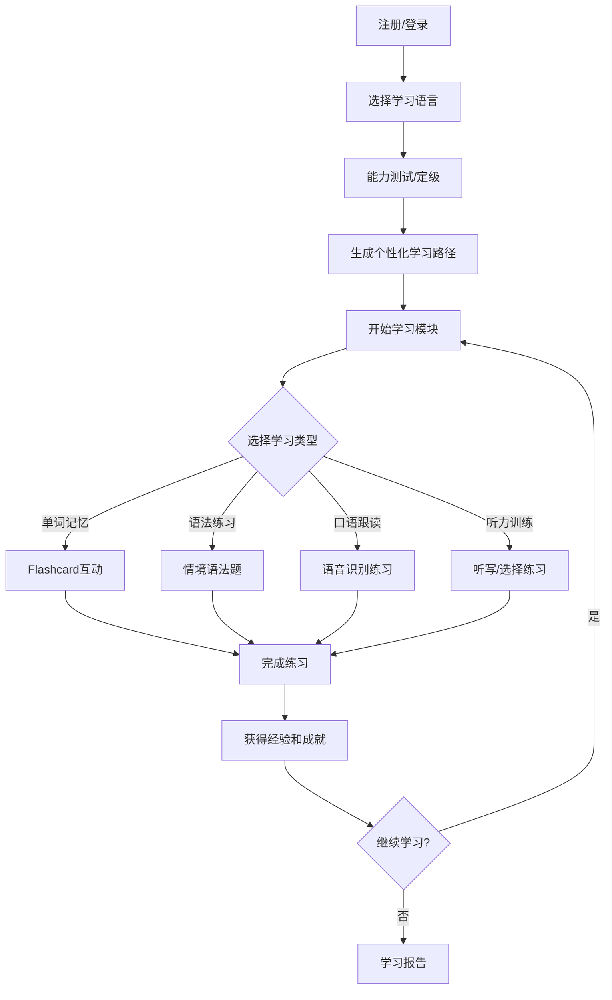
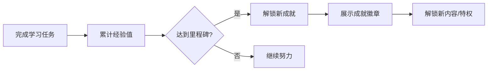

# LinguaWorld - 多语种在线教育平台产品需求文档

## 1. 产品概述

LinguaWorld 是一款沉浸式多语种学习平台，支持英语、日语、韩语等主流语言的学习。平台通过互动式学习模块、智能进度追踪和游戏化成就系统，为用户打造趣味十足的语言学习体验。

### 核心价值
- **沉浸式学习**：结合视觉、听觉多感官刺激，提升学习效率
- **个性化路径**：AI驱动的智能学习推荐，因材施教
- **社区驱动**：学习社区和成就系统，激发学习动力

### 目标用户
- 语言初学者到中高级学习者
- 有出国、留学、移民需求的用户
- 对多语言文化感兴趣的学习者

---

## 2. 核心功能

### 2.1 用户角色

| 角色 | 注册方式 | 核心权限 |
|------|----------|----------|
| 游客 | - | 浏览公开内容、体验demo |
| 注册用户 | 邮箱/手机号 | 完整学习功能、进度保存、社区互动 |
| 高级用户 | 付费订阅 | 解锁全部课程、AI辅导、专属成就 |

### 2.2 功能模块

1. **首页/仪表盘**：学习概览、每日目标、推荐课程、快速入口
2. **课程中心**：分级课程体系、课程详情、章节学习
3. **学习模块**：单词记忆、语法练习、口语跟读、听力训练
4. **个人中心**：学习进度、学习统计、成就展示、设置
5. **社区中心**：学习圈、话题讨论、学习伙伴
6. **推荐系统**：个性化学习路径、智能课程推荐

---

## 3. 核心流程

### 3.1 用户学习流程

### 3.2 成就激励流程

---

## 4. 用户界面设计

### 4.1 设计风格

**设计理念：活力学院风 - 兼具专业感与趣味性**

- **主色调**：
  - 主色：#6366F1（靛蓝紫，代表智慧与探索）
  - 辅助色：#10B981（翡翠绿，代表成长与进步）
  - 强调色：#F59E0B（琥珀橙，代表成就与活力）
  - 背景色：#F8FAFC（雪白）、#1E293B（深夜蓝-暗色模式）

- **按钮风格**：
  - 圆角胶囊按钮（border-radius: 9999px）
  - 悬停时轻微上浮 + 阴影增强
  - 主按钮带微妙渐变

- **字体选择**：
  - 标题：Poppins（现代几何感，活力十足）
  - 正文：Noto Sans SC/JP/KR（支持中日韩多语言）
  - 数字/统计：Space Mono（科技感）

- **图标风格**：
  - 使用 Phosphor Icons（圆润友好）
  - 配色与文字主题呼应

### 4.2 页面设计总览

| 页面名称 | 主要模块 | 设计特点 |
|----------|----------|----------|
| 首页仪表盘 | 欢迎区、学习统计、快速开始、推荐课程 | 卡片式布局、动态数据可视化 |
| 课程中心 | 语言切换、难度筛选、课程卡片列表 | 网格布局、悬停动效 |
| 学习模块-单词 | Flashcard翻转、例句、发音按钮 | 3D翻转动画、间隔重复UI |
| 学习模块-语法 | 情境对话、填空练习、即时反馈 | 步骤指引、动画解释 |
| 学习模块-口语 | 跟读示例、录音按钮、波形展示 | 实时波形动画、评分星星 |
| 学习模块-听力 | 音频播放、题目选项、原文对照 | 进度条、时间轴 |
| 个人中心 | 进度圆环、成就墙、学习日历 | 数据可视化、徽章展示 |
| 社区中心 | 动态流、话题卡片、用户互动 | 瀑布流、点赞动画 |
| 登录/注册 | 表单、社交登录、语言选择 | 简洁表单、分步引导 |

### 4.3 动效设计

- **页面切换**：淡入淡出 + 微小位移（300ms ease-out）
- **卡片悬停**：Y轴上移8px + 阴影扩展
- **按钮点击**：scale(0.95) → scale(1) 弹性动画
- **进度更新**：数值滚动 + 进度条流畅填充
- **成就解锁**：缩放弹入 + 光芒闪烁效果
- **列表加载**：交错淡入（stagger: 50ms）

### 4.4 响应式策略

- **桌面优先**（≥1024px）：多栏布局，充分利用屏幕空间
- **平板适配**（768px-1023px）：双栏网格，导航保持侧边栏
- **移动端**（<768px）：单栏布局，底部Tab导航，汉堡菜单

---

## 5. 数据模型

### 5.1 核心实体

| 实体 | 说明 |
|------|------|
| User | 用户信息、学习偏好、账户状态 |
| Language | 语言类型（英语/日语/韩语等） |
| Course | 课程信息、难度等级、学习人数 |
| Lesson | 课时内容、类型（单词/语法/口语/听力） |
| Progress | 用户学习进度、完成状态、得分 |
| Achievement | 成就定义、图标、解锁条件 |
| UserAchievement | 用户已解锁成就、获得时间 |
| CommunityPost | 社区动态、评论、点赞 |
| UserPath | 个性化学习路径配置 |

### 5.2 等级系统

| 等级 | 名称 | 经验值范围 | 权限 |
|------|------|-----------|------|
| 1-5 | 初学者 | 0-1000 | 基础课程 |
| 6-10 | 进阶者 | 1001-3000 | 进阶课程 |
| 11-20 | 熟练者 | 3001-8000 | 高级课程 |
| 21+ | 大师 | 8001+ | 全部内容+专属称号 |

---

## 6. 技术约束

- 前端优先：使用React + TailwindCSS实现响应式界面
- 单页应用：通过React Router实现页面路由
- 状态管理：使用React Context管理全局状态
- 数据存储：LocalStorage模拟持久化
- 无后端依赖：所有数据使用Mock数据

---

## 7. 验收标准

1. ✅ 用户可完成注册、登录、登出流程
2. ✅ 可浏览和选择不同语言的课程
3. ✅ 可体验4种学习模块（单词、语法、口语、听力）
4. ✅ 学习进度实时保存并可视化展示
5. ✅ 成就系统可正常解锁和展示
6. ✅ 社区功能支持发布动态和点赞互动
7. ✅ 个性化推荐基于用户学习数据生成
8. ✅ 界面适配桌面和移动设备
9. ✅ 所有动画流畅，无明显卡顿
