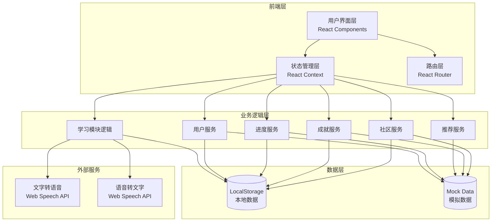
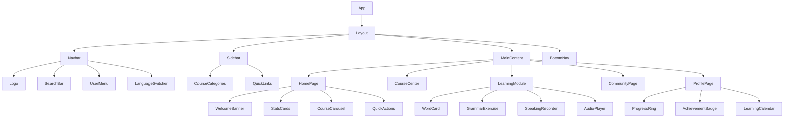
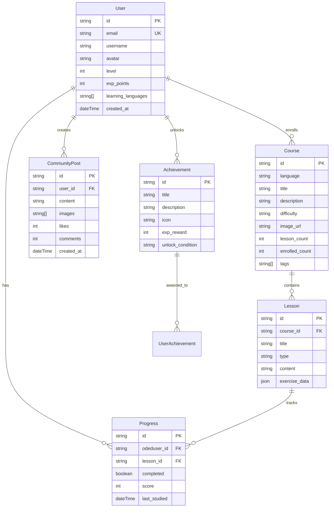

# LinguaWorld - 技术架构文档

## 1. 架构设计



## 2. 技术栈

| 类别 | 技术选型 | 说明 |
|------|----------|------|
| 框架 | React@18 | 函数式组件 + Hooks |
| 构建工具 | Vite | 快速开发体验 |
| 样式方案 | TailwindCSS@3 | 原子化CSS，响应式支持 |
| 路由 | React Router DOM@6 | SPA路由管理 |
| 状态管理 | React Context API | 全局状态管理 |
| 图标 | Phosphor Icons | 统一图标库 |
| 动画 | Framer Motion | 流畅交互动画 |
| 数据持久化 | LocalStorage | 本地数据存储 |
| 语音合成 | Web Speech API | 发音朗读功能 |

## 3. 路由定义

| 路由 | 页面组件 | 功能说明 |
|------|----------|----------|
| / | HomePage | 首页仪表盘 |
| /courses | CourseCenter | 课程中心 |
| /course/:id | CourseDetail | 课程详情 |
| /learn/:type | LearningModule | 学习模块入口 |
| /learn/words | WordLearning | 单词记忆模块 |
| /learn/grammar | GrammarPractice | 语法练习模块 |
| /learn/speaking | SpeakingPractice | 口语跟读模块 |
| /learn/listening | ListeningPractice | 听力训练模块 |
| /community | CommunityPage | 社区中心 |
| /profile | ProfilePage | 个人中心 |
| /achievements | AchievementsPage | 成就展示页 |
| /login | LoginPage | 登录页 |
| /register | RegisterPage | 注册页 |

## 4. 组件架构



## 5. 数据模型

### 5.1 数据实体定义



### 5.2 LocalStorage 数据结构

```typescript
interface AppState {
  user: User | null;
  progress: {
    [lessonId: string]: Progress;
  };
  achievements: string[];
  favorites: string[];
  settings: {
    theme: 'light' | 'dark';
    dailyGoal: number;
    notifications: boolean;
  };
}
```

## 6. API 模拟（无后端）

由于采用纯前端架构，所有数据操作通过本地服务模拟：

```typescript
// 用户服务
const UserService = {
  login(email, password): Promise<User>
  register(userData): Promise<User>
  logout(): void
  updateProfile(data): Promise<User>
}

// 课程服务
const CourseService = {
  getCourses(filters?): Promise<Course[]>
  getCourseById(id): Promise<Course>
  getLessons(courseId): Promise<Lesson[]>
}

// 学习服务
const LearningService = {
  saveProgress(lessonId, data): Promise<void>
  getProgress(): Promise<Progress[]>
  calculateStats(): Promise<LearningStats>
}

// 成就服务
const AchievementService = {
  checkAndUnlock(): Promise<Achievement[]>
  getAllAchievements(): Promise<Achievement[]>
  getUserAchievements(): Promise<UserAchievement[]>
}

// 推荐服务
const RecommendationService = {
  getRecommendedCourses(): Promise<Course[]>
  getPersonalizedPath(): Promise<LearningPath>
}
```

## 7. 目录结构

```
linguaworld/
├── public/
│   └── favicon.svg
├── src/
│   ├── components/
│   │   ├── layout/
│   │   │   ├── Navbar.jsx
│   │   │   ├── Sidebar.jsx
│   │   │   └── BottomNav.jsx
│   │   ├── common/
│   │   │   ├── Button.jsx
│   │   │   ├── Card.jsx
│   │   │   ├── Modal.jsx
│   │   │   └── ProgressRing.jsx
│   │   ├── learning/
│   │   │   ├── WordCard.jsx
│   │   │   ├── GrammarExercise.jsx
│   │   │   ├── SpeakingRecorder.jsx
│   │   │   └── AudioPlayer.jsx
│   │   └── community/
│   │       ├── PostCard.jsx
│   │       └── CommentSection.jsx
│   ├── pages/
│   │   ├── HomePage.jsx
│   │   ├── CourseCenter.jsx
│   │   ├── CourseDetail.jsx
│   │   ├── WordLearning.jsx
│   │   ├── GrammarPractice.jsx
│   │   ├── SpeakingPractice.jsx
│   │   ├── ListeningPractice.jsx
│   │   ├── CommunityPage.jsx
│   │   ├── ProfilePage.jsx
│   │   ├── AchievementsPage.jsx
│   │   ├── LoginPage.jsx
│   │   └── RegisterPage.jsx
│   ├── context/
│   │   ├── AuthContext.jsx
│   │   ├── LearningContext.jsx
│   │   └── ThemeContext.jsx
│   ├── services/
│   │   ├── userService.js
│   │   ├── courseService.js
│   │   ├── learningService.js
│   │   ├── achievementService.js
│   │   └── communityService.js
│   ├── data/
│   │   ├── mockCourses.js
│   │   ├── mockLessons.js
│   │   ├── mockAchievements.js
│   │   └── mockCommunity.js
│   ├── hooks/
│   │   ├── useLocalStorage.js
│   │   └── useSpeech.js
│   ├── utils/
│   │   └── helpers.js
│   ├── App.jsx
│   ├── main.jsx
│   └── index.css
├── index.html
├── package.json
├── vite.config.js
├── tailwind.config.js
└── postcss.config.js
```

## 8. 性能优化策略

1. **路由懒加载**：使用 React.lazy 和 Suspense 动态导入页面组件
2. **图片优化**：使用 WebP 格式，懒加载非首屏图片
3. **代码分割**：按功能模块进行代码分割
4. **动画优化**：使用 CSS transform 和 opacity 触发 GPU 加速
5. **状态优化**：合理拆分 Context，避免不必要的重渲染

## 9. 可访问性

- 所有交互元素支持键盘导航
- 图片添加 alt 属性
- 颜色对比度符合 WCAG 2.1 AA 标准
- 表单元素正确关联标签
- 支持屏幕阅读器
